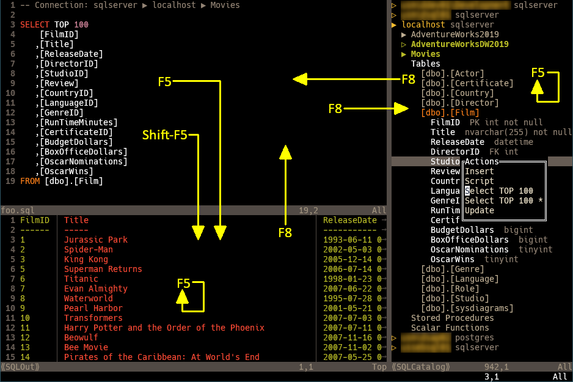

# sql.nvim

## Overview

This package is a Neovim implementation of a very small portion of what SSMS does. It provides the following functionality, through the use of command-line query tools:

1. Connect to multiple database types, currently SQL Server and PostgreSQL.
1. Display a catalog window showing objects defined in the database(s).
1. Run an entire SQL script, or a paragraph or visual selection in it.
1. Craft SQL statements related to the object under the cursor, such as SELECT, INSERT, UPDATE, etc. Statements are placed in the unnamed register, ready for pasting.



## Installation

Use your favorite plugin manager. If you don't have one, try one of these: [vim-pathogen](https://github.com/tpope/vim-pathogen), [vim-plug](https://github.com/junegunn/vim-plug), [Packer.nvim](https://github.com/wbthomason/packer.nvim) or [lazy.nvim](https://github.com/folke/lazy.nvim). Or, use packages and submodules, as Greg Hurrell ([@wincent](https://github.com/wincent)) describes in his excellent Youtube video: [Vim screencast #75: Plugin managers](https://www.youtube.com/watch?v=X2_R3uxDN6g)

## Filetypes

### `sql`
Buffers of this type are where queries are written. The `:SQL` command will either set the filetype of the current empty buffer, or create a new buffer of this filetype. Alternatively, you could open an existing SQL file, and you can have more than one buffer of this type open at once.

* <kbd>F5</kbd> - Submits the whole file or the visual selection to the database.
* <kbd>Shift+F5</kbd> - Submits the current paragraph to the database.
* <kbd>F8</kbd> - Opens a window showing the servers' catalogs. Actions done in the catalog will target the SQL buffer active when <kbd>F8</kbd> was pressed.

### `sqlcatalog` - Buffer Name: ⟪SQLCatalog⟫
This buffer shows the platforms and servers listed in the user config, and the databases and objects that are defined in them.

* <kbd>l</kbd> - Expands the outline, if collaped.
* <kbd>l</kbd> - Opens a popup menu of actions that can be done on the database object.
* <kbd>h</kbd> - Collapses the outline.
* <kbd>Enter</kbd> - Makes the SQL buffer target this database when running its queries.
* <kbd>q</kbd> or <kbd>Esc</kbd> - Closes the SQL Catalog window.
* <kbd>F5</kbd> - Refreshes the catalog. This is helpful after a CREATE or DROP, or after `:SQLUserConfig`.
* <kbd>F8</kbd> - Returns to the SQL buffer that opened the Catalog.

### `sqlout` - Buffer Name: ⟪SQLOut⟫
This buffer shows the output from running the SQL script.

* <kbd>F5</kbd> - Re-runs the last query.
* <kbd>F8</kbd> - Returns to the SQL buffer where the query is defined.

## User Configuration
All the information about the servers and the platforms they're running is stored in a JSON file that you can edit with the `:SQLUserConfig` command. If the file is not found, the plugin will create it with the following sample contents. It is intended to show you the proper structure, but you must fill it out to match your environment.

```json
// Complete the user configuration below, and then remove these comments. For details,
// see https://github.com/PhilRunninger/sql.nvim?tab=readme-ov-file#user-configuration.
{
    "sqlserver": {
        "delimiter": ";",
        "servers": {
            "server1": {
                "-U": "user",
                "-P": "password"
            },
            "server2": {"order":1}
        }
    },
    "postgres": {
        "alignLimit": 0,
        "servers": {
            "server3": {
                "-p": 5432
            }
        }
    }
}
```
* The root object contains an object for each supported platform, currently just `"sqlserver": {...}` and `"postgres": {...}`. If one is not required, it can be removed. The default command lines are shown here (`<server>`, `<database>`, `<file>`, and `<delimiter>` are placeholders):
    * **sqlserver**: `sqlcmd -S <server> -d <database> -i <file> -s \"<delimiter>\" -W -I -f 65001`
    * **postgres**: `psql -h <server> -d <database> -f <file> -F\"<delimiter>\" -A`
* Each `<platform>` object contains:
    * a `"servers": {...}` object, and
    * an optional `"alignLimit"` numeric value. If the time estimate for doing the alignment exceeds this threshold, it is skipped. The default is `5` seconds. A value of `0` turns alignment off.
    * an optional `"delimiter"` string value. This is used as the delimiter between columns in the query results. The default is `"|"`.
* The `"servers"` object contains an object for each server of interest.
* The `<server>` objects hold additional command-line arguments as needed: user ID, password, port, etc. To specify a switch that has no value, enter it like so: `{"-j": null}`. The additional arguments are appended to the platform's default command line.
* The `<server>` objects also can have a special integer value named `"order"`. Use this to move favorites to the top. Servers are sorted primarily by `"order"` (ones without `"order"` are placed below the rest), and secondarily by name.

## Dependencies
- For running **sqlserver** queries, [sqlcmd.exe](https://learn.microsoft.com/en-us/sql/tools/sqlcmd/sqlcmd-utility?view=sql-server-ver16&tabs=go%2Cwindows&pivots=cs1-cmd) must be installed and in the path.
- For running **postgres** queries, [psql.exe](https://www.postgresql.org/docs/current/app-psql.html) must be installed and in the path.

If the following optional plugins are installed, they will be used to improve to format the results.
- [EasyAlign](https://github.com/junegunn/vim-easy-align) aligns the text into columns, if the output isn't too large.
- [csv.vim](https://github.com/chrisbra/csv.vim) highlights the columns in alternating colors.
